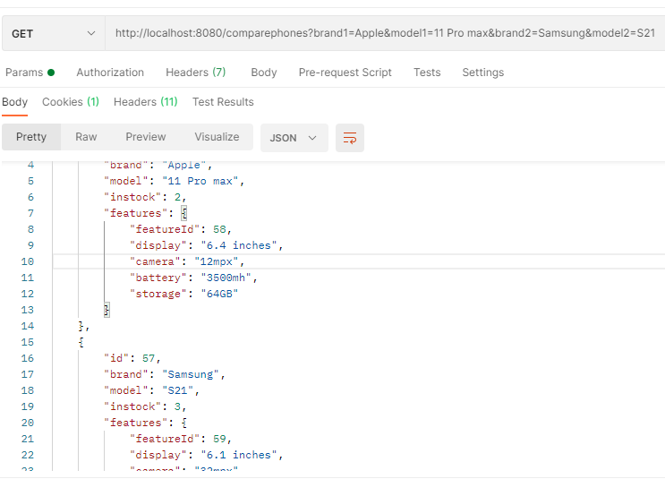
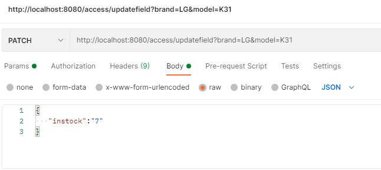

## CompareOPhone App
**Inventory Control System along with product comparision feature**

## How I got an Idea About this App

Currently in which company I am working,that is a cell phone retails company.EveryTime when customer ask the difference between phones we offer or ask about features of phones. we have to search on google.Which creates a gap between communications. which is Time consuming and sometimes causes losing a sale. To resolve this problem I come up with idea to develop this app. For more 
detail see Features section below.

## Table of contents
* [Technologies](#technologies)
* [Features](#features)
* [Screenshots](#screenshots)
* [Status](#status)

## Technologies
1. Java
2. SpringBoot----> properly configure spring security in project
3. MySql
4. Postman------> To test Api's
5. Hibernate

## Features
1. Comparision of two phones
2. Add,update,delete phones and features in the database
3. We can get list of phones according to brand like Samsung, Apple
4. Add,delete,update employees who would have access of contents and feature. 
5. Access can be controlled by admin or Manager 
6. Reset password feature if someone forget password

## Screenshots

**Note:// For more screenshots explore to screenshot folder**

## Status
Complete

All requried features are added. However, In this project web Email Api can be added. 

